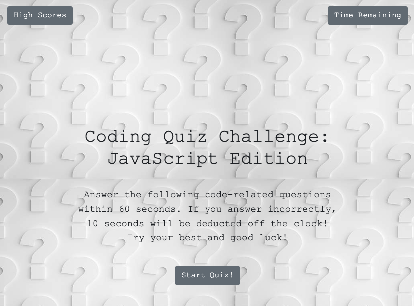

# Create a Timed Quiz to Test Boot Camp Student's javaScript Knowledge Using Web API's

## Creating your own starter code, indivudually implement the following USER story: 

* AS A coding boot camp student I WANT to take a timed quiz on JavaScript fundamentals that stores high scores SO THAT I can gauge my progress compared to my peers

## Acceptance Criteria

GIVEN I am taking a code quiz
* WHEN I click the start button THEN a timer starts and I am presented with a question
* WHEN I answer a question THEN I am presented with another question
* WHEN I answer a question incorrectly THEN time is subtracted from the clock
* WHEN all questions are answered or the timer reaches 0 THEN the game is over
* WHEN the game is over THEN I can save my initials and score

## Assets

### Screenshot 

This is the homepage of the quiz game

This is what the separate high score page looks like 

### Built Using
* Bootstrap 
* JavaScript
* CSS 
* HTML

### Link to deployed application 

https://gdebortoli.github.io/jS.API.fundamental.quizGame/ 

This site was build using [Github Pages](https://gdebortoli.github.io/jS.API.fundamental.quizGame/)